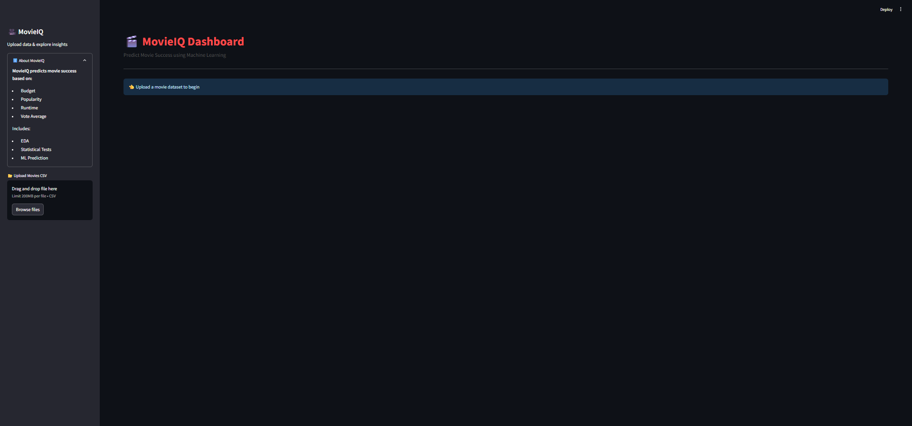

# 🎬 CinePrdict
### Predictive Analytics & Machine Learning on Film Success

**CinePrdict** is an interactive **Streamlit-based data analytics dashboard** that explores, analyzes, and predicts the success of movies using key financial and audience-related features. The project combines **exploratory data analysis (EDA)**, **statistical hypothesis testing**, and **machine learning** to provide actionable insights into what makes a movie successful.

A movie is classified as **successful** if its **revenue exceeds its budget**.

---

## 🌐 Live Application

🚀 **Try the deployed app here:**  
👉 https://cinepredict.streamlit.app/

---

## 🎯 Project Objectives

- Analyze movie performance using financial and popularity indicators  
- Identify statistically significant differences between successful and unsuccessful movies  
- Build a machine learning model to predict movie success  
- Present insights through an interactive, user-friendly dashboard  

---

## ✨ Key Features

- 🎬 **Movie Success Prediction**  
  Predicts whether a movie will be successful based on:
  - Budget  
  - Popularity  
  - Runtime  
  - Vote Average  

- 📊 **Exploratory Data Analysis (EDA)**  
  - Budget vs Revenue visualization  
  - Genre-wise trends  
  - Comparative analysis of successful vs unsuccessful movies  

- 📈 **Statistical Testing**  
  - **T-Test**: Analyzes differences in vote averages  
  - **Chi-Square Test**: Examines the relationship between genre and success  

- 🤖 **Machine Learning Model**  
  - Random Forest Classifier  
  - Handles non-linear relationships and feature interactions  
  - Displays accuracy, classification report, and confusion matrix  

- 🎛️ **Interactive Dashboard**  
  - Genre-based filtering  
  - Minimum vote average slider  
  - Real-time predictions using user inputs  

- 📥 **Downloadable Data**  
  - Export filtered datasets directly from the app  

---

## 🧠 Why Random Forest?

Random Forest was chosen because:
- Movie success depends on **non-linear relationships**
- It is **robust to outliers**
- Requires **minimal preprocessing**
- Reduces overfitting using ensemble learning
- Works exceptionally well on **tabular data**

---

## 🧰 Tech Stack

- **Programming Language:** Python 🐍  
- **Data Handling:** Pandas, NumPy  
- **Visualization:** Matplotlib, Seaborn  
- **Machine Learning:** Scikit-learn  
- **Statistical Analysis:** SciPy  
- **Web App Framework:** Streamlit  

---

## 📷 Screenshots

Dashboard Overview 
|--------------------|
 |


## 🚀 Run the Project Locally

### 1️⃣ Clone the Repository
```bash
git clone https://github.com/Gaurang-Singhania/CinePredict.git
cd CinePredict
